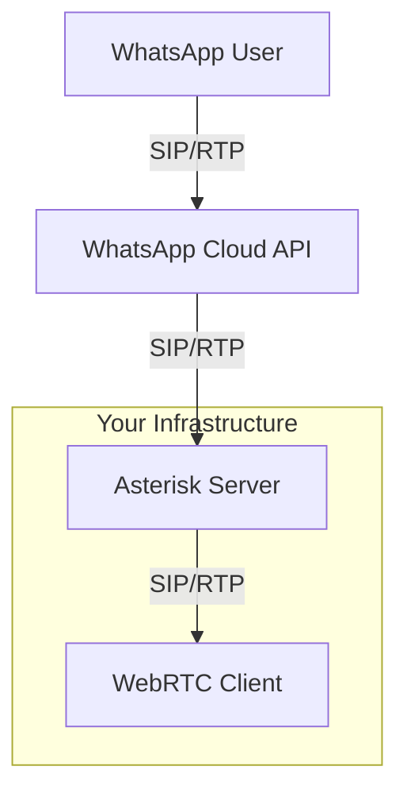

# WhatsApp Cloud API with Asterisk and WebRTC Integration

This document outlines the configuration and conceptual architecture for integrating WhatsApp Cloud API calling with an Asterisk server, enabling voice calls between WhatsApp users and a WebRTC client.

## Table of Contents

1.  [Architecture Overview](#architecture-overview)
2.  [Prerequisites](#prerequisites)
3.  [WhatsApp Cloud API Configuration](#whatsapp-cloud-api-configuration)
4.  [Asterisk Configuration](#asterisk-configuration)
    *   [pjsip.conf](#pjsipconf)
    *   [extensions.conf](#extensionsconf)
    *   [TLS Certificates](#tls-certificates)
5.  [Conceptual ARI Script (Node.js)](#conceptual-ari-script-nodejs)
6.  [WebRTC Client Configuration](#webrtc-client-configuration)
7.  [Call Flows](#call-flows)
    *   [Inbound: WhatsApp User to WebRTC Client](#inbound-whatsapp-user-to-webrtc-client)
    *   [Outbound: WebRTC Client to WhatsApp User](#outbound-webrtc-client-to-whatsapp-user)

## Architecture Overview

The system enables voice communication between WhatsApp users and a WebRTC client, using Asterisk as a SIP intermediary.

*   **WhatsApp Cloud API:** Connects to Asterisk via a SIP trunk for call signaling and media.
*   **Asterisk:**
    *   Receives SIP calls from WhatsApp.
    *   Routes calls to the appropriate WebRTC client extension.
    *   Receives SIP calls from the WebRTC client.
    *   Routes calls to WhatsApp via the SIP trunk.
    *   Handles SIP signaling and RTP media relay.
*   **WebRTC Client:** A browser-based SIP client (as found in this repository) that registers with Asterisk and makes/receives calls.
*   **ARI (Asterisk REST Interface) Script (Conceptual):** While not implemented due to project constraints (no library installation), an ARI script would typically manage call logic, such as bridging calls, handling call events, and interacting with external systems if needed. For this setup, basic dialing is handled by `extensions.conf`. More complex scenarios might require ARI.



## Prerequisites

1.  An operational Asterisk server.
2.  A WhatsApp Business Account with a phone number enabled for Cloud API.
3.  Calling features enabled for your WhatsApp Business phone number, with SIP integration configured.
4.  TLS certificates for Asterisk (for WSS and DTLS-SRTP).
5.  The WebRTC client in this repository configured to connect to your Asterisk.

## WhatsApp Cloud API Configuration

1.  **Enable SIP for Calling:**
    *   In your WhatsApp Business Account settings, navigate to the Calling section for your phone number.
    *   Enable SIP integration. You will need to provide your Asterisk server's public IP address or hostname and the SIP port Asterisk is listening on (e.g., `your_asterisk_server_ip:5060`).
    *   WhatsApp will provide you with a SIP URI (e.g., `sip:<some_id>@c.whatsapp.net`) and potentially credentials or IP whitelisting requirements. This URI is referred to as `YOUR_WHATSAPP_SIP_URI` and its domain as `YOUR_WHATSAPP_SIP_DOMAIN` in the Asterisk configuration.
    *   Ensure that your Asterisk server's firewall allows traffic from WhatsApp's IP ranges on the configured SIP and RTP ports.

2.  **Set `srtp_key_exchange_protocol`:**
    *   The WhatsApp Cloud API documentation mentions configuring `srtp_key_exchange_protocol`. For WebRTC compatibility, DTLS is standard. If you encounter issues, you might need to align this setting with your Asterisk PJSIP endpoint configuration (which uses DTLS by default for WebRTC).

## Asterisk Configuration

Place the following configuration files (`pjsip.conf`, `extensions.conf`) in your Asterisk configuration directory (e.g., `/etc/asterisk/`).

### `pjsip.conf`

This file configures PJSIP endpoints, transports, and AORs (Address of Record).

```ini
[transport-udp]
type=transport
protocol=udp
bind=0.0.0.0 ; Binds to all interfaces for UDP SIP traffic

[transport-ws]
type=transport
protocol=ws ; WebSocket for WebRTC
bind=0.0.0.0:8088 ; Or your preferred port for WS, ensure it's different from WSS if used
; If using WSS (Secure WebSockets), configure as below:
; [transport-wss]
; type=transport
; protocol=wss
; bind=0.0.0.0:8089 ; Your preferred port for WSS
; cert_file=/etc/asterisk/keys/asterisk.pem
; priv_key_file=/etc/asterisk/keys/asterisk.pem
; method=tlsv1_2

;--- WhatsApp Trunk Configuration ---
[whatsapp_trunk_aor]
type=aor
contact=sip:YOUR_WHATSAPP_SIP_URI ; IMPORTANT: Replace with the SIP URI provided by WhatsApp
; remove_existing=yes ; Optional: if WhatsApp uses a dynamic contact

[whatsapp_trunk_endpoint]
type=endpoint
context=from-whatsapp ; Context for incoming calls from WhatsApp
disallow=all
allow=opus,ulaw,alaw ; Ensure these codecs match what WhatsApp supports
transport=transport-udp
aors=whatsapp_trunk_aor
from_domain=YOUR_WHATSAPP_SIP_DOMAIN ; IMPORTANT: Replace with WhatsApp's SIP domain (e.g., c.whatsapp.net)
send_rpid=yes ; Send Remote-Party-ID
trust_id_inbound=yes ; Trust identity from WhatsApp
rtp_symmetric=yes
force_rport=yes
rewrite_contact=yes
outbound_proxy=sip:YOUR_WHATSAPP_SIP_URI ; IMPORTANT: For sending calls TO WhatsApp

[whatsapp_trunk_identify]
type=identify
endpoint=whatsapp_trunk_endpoint
match=YOUR_WHATSAPP_SIP_DOMAIN ; Match incoming calls from WhatsApp's domain

;--- WebRTC Client Configuration ---
[webrtc_template](!) ; Template for WebRTC endpoints
type=endpoint
context=from-webrtc ; Context for outgoing calls from WebRTC client
disallow=all
allow=opus,ulaw,alaw ; Opus is highly recommended for WebRTC
transport=transport-ws ; Or transport-wss if you configured secure websockets
aors=webrtc_client_aor ; Placeholder, will be defined per client
dtls_verify=fingerprint
dtls_cert_file=/etc/asterisk/keys/asterisk.pem ; Path to your Asterisk certificate (fullchain)
dtls_private_key=/etc/asterisk/keys/asterisk.pem ; Path to your Asterisk private key
dtls_setup=actpass
ice_support=yes
media_use_received_transport=yes
rtcp_mux=yes
use_avpf=yes
force_avp=yes ; May be needed for some WebRTC clients
send_rpid=yes
trust_id_inbound=yes ; If you trust the identity from your WebRTC clients
rtp_symmetric=yes
force_rport=yes
rewrite_contact=yes

[webrtc_client_aor_template](!)
type=aor
max_contacts=1
remove_existing=yes ; Ensures only one registration per client

; Example WebRTC Client Endpoint
[web_client](webrtc_template) ; Inherits from webrtc_template
type=endpoint
auth_type=userpass
username=webclientuser
password=supersecretpassword ; Strong password recommended
aors=web_client_aor_specific

[web_client_aor_specific](webrtc_client_aor_template) ; Inherits from webrtc_client_aor_template
type=aor
; Specific AOR for this client, if needed, otherwise the template's aors can be used directly
; if the endpoint name matches the aor name (e.g. aors=web_client)
```

**Key `pjsip.conf` Notes:**

*   **`YOUR_WHATSAPP_SIP_URI`**: This is the full SIP URI provided by WhatsApp for outbound calls *to* them (used in `contact` for the AOR and `outbound_proxy` for the endpoint).
*   **`YOUR_WHATSAPP_SIP_DOMAIN`**: This is the domain part of the SIP URI from which WhatsApp will send calls *to* you (e.g., `c.whatsapp.net` or a specific subdomain). Used for `from_domain` and `match` in the identify section.
*   **Codecs:** Ensure `opus` is enabled and prioritized, as it's common for WebRTC and often supported by modern SIP providers. `ulaw` and `alaw` are good fallbacks.
*   **Transport:**
    *   WhatsApp typically uses UDP for SIP.
    *   WebRTC clients use WebSockets (`ws` or `wss`). If using `wss` (recommended for production), ensure `cert_file` and `priv_key_file` point to your valid TLS certificates.
*   **Authentication:** The `web_client` uses `userpass`. The WebRTC client in this repository will need to be configured with these credentials.
*   **`rtp_symmetric`, `force_rport`, `rewrite_contact`:** These are often necessary for proper NAT traversal with PJSIP.
*   **Firewall:** Ensure your firewall allows UDP traffic on your SIP port (default 5060) and the RTP port range (default 10000-20000 UDP) from WhatsApp's IP addresses. Also, allow TCP traffic on your WebSocket port (e.g., 8088 for `ws` or 8089 for `wss`) from your WebRTC clients.

### `extensions.conf`

This file defines the dialplan logic for routing calls.

```ini
[general]
static=yes
writeprotect=no
clearglobalvars=no

[globals]
WEB_CLIENT_EXTEN=1000 ; Example extension for the WebRTC client. This should match the user the WebRTC client registers as, or a way to reach them.
YOUR_WHATSAPP_BUSINESS_NUMBER=+12345678901 ; IMPORTANT: Your full WhatsApp Business number with country code

[from-whatsapp]
; Context for incoming calls from WhatsApp
exten => _X.,1,NoOp(Incoming call from WhatsApp: ${CALLERID(all)} to ${EXTEN})
  ; Here, EXTEN will be the number WhatsApp is trying to reach (likely your WhatsApp Business Number)
  ; We want to route this to our internal WebRTC client extension
  same => n,Dial(PJSIP/${WEB_CLIENT_EXTEN},45,Ttor) ; Dial the WebRTC client (exten 1000) for 45 seconds
  same => n,Hangup()

[from-webrtc]
; Context for outgoing calls from the WebRTC client
exten => _X.,1,NoOp(Outgoing call from WebRTC client ${CALLERID(num)} to WhatsApp user ${EXTEN})
  ; Set the Caller ID to your WhatsApp Business Number so WhatsApp recognizes the call origin
  same => n,Set(CALLERID(num)=${YOUR_WHATSAPP_BUSINESS_NUMBER})
  ; Dial out through the whatsapp_trunk_endpoint. The EXTEN here is the WhatsApp user's number.
  same => n,Dial(PJSIP/${EXTEN}@whatsapp_trunk_endpoint,60,Ttor)
  same => n,Hangup()

; Dialing the WebRTC client directly (e.g. if it registers as 1000)
exten => ${WEB_CLIENT_EXTEN},1,NoOp(Call to WebRTC client ${EXTEN} from ${CALLERID(num)})
  same => n,Dial(PJSIP/web_client,45,Ttor) ; Assumes web_client is the PJSIP endpoint name
  same => n,Hangup()
```

**Key `extensions.conf` Notes:**

*   **`WEB_CLIENT_EXTEN`**: This is the internal extension number you assign to your WebRTC client.
*   **`YOUR_WHATSAPP_BUSINESS_NUMBER`**:  Crucial for outgoing calls to WhatsApp. This ensures WhatsApp can correctly associate the call with your business account.
*   **`from-whatsapp` context**: When a call comes from WhatsApp, it will likely be to your main WhatsApp number. This context takes that call and dials your internal WebRTC client extension.
*   **`from-webrtc` context**: When your WebRTC client dials a number, this context sets the correct caller ID and dials out via the `whatsapp_trunk_endpoint`.
*   **`Dial` application options `Ttor`**:
    *   `T`: Allow the called party to transfer the call.
    *   `t`: Allow the calling party to transfer the call.
    *   `o`: Set the caller ID to what was set by `Set(CALLERID(num)=...)` for calls to the PJSIP channel.
    *   `r`: Generate ringing to the calling party.

### TLS Certificates

For WebRTC (specifically for `wss` transport and DTLS-SRTP), Asterisk needs valid TLS certificates.

1.  **Obtain Certificates:** Use Let's Encrypt (recommended for public servers) or create self-signed certificates for testing.
    *   For Let's Encrypt, tools like `certbot` can automate this. You'll typically get `fullchain.pem` and `privkey.pem`.
2.  **Combine Certificates (if needed):** Asterisk PJSIP often expects the certificate and private key in a single `.pem` file for `dtls_cert_file` and `dtls_private_key`. You can concatenate them:
    ```bash
    cat /path/to/your/privkey.pem /path/to/your/fullchain.pem > /etc/asterisk/keys/asterisk.pem
    ```
    Ensure the private key comes first in the combined file.
3.  **Permissions:** Make sure the Asterisk user has read access to these certificate files.
    ```bash
    chown asterisk:asterisk /etc/asterisk/keys/asterisk.pem
    chmod 600 /etc/asterisk/keys/asterisk.pem
    ```
    (Adjust user/group if your Asterisk runs as a different user).

## Conceptual ARI Script (Node.js)

**Important:** As per the initial request, no libraries are to be installed. The following is a conceptual guide. For a real implementation, you would install `asterisk-ari-client` and `ws`.

This script outlines how you *could* use ARI for more advanced call control. For the basic routing described, `extensions.conf` is sufficient.

```javascript
// Filename: conceptual-ari-app.js
// IMPORTANT: This is conceptual. You would need to install 'asterisk-ari-client' and 'ws'.
// const Ari = require('asterisk-ari-client');
// const WebSocket = require('ws');

const ARI_USER = 'asterisk_ari_user'; // Define this user in ari.conf
const ARI_PASSWORD = 'ari_password';   // Define this password in ari.conf
const ARI_URL = 'http://localhost:8088'; // Your Asterisk ARI HTTP URL
const APP_NAME = 'whatsapp-connector';   // Your Stasis application name, defined in extensions.conf

/*
Conceptual Logic:

1. Connect to ARI:
   - Establish a WebSocket connection to Asterisk's ARI event stream.
   - Authenticate with ARI.

2. Stasis Application Registration:
   - In extensions.conf, incoming calls from WhatsApp would be directed to a Stasis() application.
     Example in extensions.conf [from-whatsapp]:
     exten => _X.,1,NoOp(ARI handling for ${EXTEN})
     same => n,Stasis(whatsapp-connector,${EXTEN}) ; Pass dialed number to ARI app
     same => n,Hangup()

3. Handle 'StasisStart' Event:
   - When a call enters the Stasis application (e.g., an incoming WhatsApp call).
   - The event contains the incoming channel.
   - Extract caller information (e.g., CALLERID(num) from WhatsApp).
   - Get the dialed number (passed as an argument to Stasis).

4. Originate Outgoing Call to WebRTC Client:
   - Use ARI to create a new call (originate) to the WebRTC client's PJSIP endpoint.
     e.g., `PJSIP/web_client` or `PJSIP/1000`.

5. Bridge Calls:
   - Once the outgoing call to the WebRTC client is answered ('ChannelStateChange' to 'Up', or another 'StasisStart' if the WebRTC client is also in a Stasis app).
   - Create a new bridge in ARI.
   - Add both the incoming WhatsApp channel and the outgoing WebRTC client channel to the bridge.
   - Media will then flow between the two parties.

6. Handle 'StasisEnd' Event:
   - When a channel involved in the Stasis application hangs up.
   - If one party hangs up, ensure the other channel in the bridge is also hung up.
   - Clean up resources (e.g., destroy the bridge).

7. Handle Outbound Calls (WebRTC to WhatsApp):
   - If the WebRTC client dials out via a Stasis app (less common for basic SIP trunking, usually handled by dialplan).
   - 'StasisStart' for the WebRTC client's channel.
   - Originate a call to WhatsApp via the PJSIP trunk (`PJSIP/${NUMBER_TO_DIAL}@whatsapp_trunk_endpoint`).
   - Bridge the calls.

Error Handling:
 - Implement robust error handling for ARI commands and events.
 - Handle scenarios like call rejection, busy signals, timeouts.

Example ARI Client Usage (Conceptual):

async function startAriApp() {
    let client;
    try {
        // client = await Ari.connect(ARI_URL, ARI_USER, ARI_PASSWORD);
        console.log('Conceptual: Connected to ARI');

        // client.on('StasisStart', async (event, incomingChannel) => {
        //     console.log(`Conceptual: Call ${incomingChannel.id} entering Stasis app. Dialed: ${event.args[0]}`);
        //     await incomingChannel.answer(); // Answer the incoming call from WhatsApp

        //     const webRtcEndpoint = 'PJSIP/web_client'; // Or your specific WebRTC client endpoint
        //     let outgoingChannel;
        //     try {
        //         // outgoingChannel = await client.channels.originate({
        //         //   endpoint: webRtcEndpoint,
        //         //   app: APP_NAME, // Or another app, or just dialplan
        //         //   callerId: event.channel.caller.number, // Pass original caller ID
        //         // });
        //         console.log(`Conceptual: Originated call to ${webRtcEndpoint}`);

        //         const bridge = client.Bridge();
        //         await bridge.create({ type: 'mixing' });
        //         console.log(`Conceptual: Bridge ${bridge.id} created.`);

        //         await bridge.addChannel({ channel: [incomingChannel.id, outgoingChannel.id] });
        //         console.log(`Conceptual: Added channels to bridge.`);

        //         incomingChannel.on('StasisEnd', () => {
        //             console.log(`Conceptual: Incoming channel ${incomingChannel.id} hung up.`);
        //             // outgoingChannel.hangup().catch(err => console.error(err));
        //             // bridge.destroy().catch(err => console.error(err));
        //         });
        //         outgoingChannel.on('StasisEnd', () => {
        //             console.log(`Conceptual: Outgoing channel ${outgoingChannel.id} hung up.`);
        //             // incomingChannel.hangup().catch(err => console.error(err));
        //             // bridge.destroy().catch(err => console.error(err));
        //         });

        //     } catch (err) {
        //         console.error('Conceptual: Error originating or bridging call:', err);
        //         // incomingChannel.hangup().catch(e => console.error(e));
        //     }
        // });

        // await client.start(APP_NAME); // Start listening for events for this app
        console.log(`Conceptual: Stasis application '${APP_NAME}' started and listening.`);

    } catch (err) {
        console.error('Conceptual: Could not connect to ARI or start app:', err);
        process.exit(1);
    }
}

// startAriApp(); // Call this function to start

*/

console.log("This is a conceptual ARI script placeholder. See comments for logic.");
console.log("For actual implementation, uncomment and install 'asterisk-ari-client' and 'ws'.");
console.log("You would also need to configure 'ari.conf' and 'http.conf' in Asterisk,");
console.log("and adjust 'extensions.conf' to send calls to the Stasis application.");
```

**To make ARI functional (beyond this conceptual placeholder):**

1.  **Configure `ari.conf`:**
    *   Enable ARI and define a user with permissions.
    ```ini
    ; /etc/asterisk/ari.conf
    [general]
    enabled = yes
    pretty = yes ; For easier debugging

    [asterisk_ari_user] ; Matches ARI_USER in script
    type = user
    read_only = no ; For call control actions
    password = ari_password ; Matches ARI_PASSWORD
    ; password_format = plain ; If using plain text password
    ```
2.  **Configure `http.conf`:**
    *   Enable the Asterisk HTTP server, which ARI uses.
    ```ini
    ; /etc/asterisk/http.conf
    [general]
    enabled = yes
    bindaddr = 0.0.0.0 ; Or a specific interface
    bindport = 8088     ; Matches ARI_URL
    prefix = ari        ; Sets the base path to /ari
    ```
3.  **Reload Asterisk modules:**
    *   `module reload res_ari.so`
    *   `module reload res_stasis.so`
    *   `module reload res_http_websocket.so` (if not already loaded)
    *   `http reload` (or `core reload`)

## WebRTC Client Configuration

The WebRTC client (from this repository, `src/lib/client-phone`) needs to be configured to register with Asterisk:

*   **SIP Server / WebSocket URL:** `ws://your_asterisk_server_ip:8088/ws` (or `wss://your_asterisk_server_ip:8089/ws` if using WSS). The `/ws` path is standard for PJSIP WebSocket transport.
*   **SIP Username:** `webclientuser` (from `pjsip.conf`)
*   **SIP Password:** `supersecretpassword` (from `pjsip.conf`)
*   **SIP Display Name:** Any preferred name.
*   **Extension to Dial:** When making outbound calls, the client will dial the WhatsApp user's phone number (e.g., `+15551234567`).
*   **Codecs:** Ensure the client is configured to use Opus.

## Call Flows

### Inbound: WhatsApp User to WebRTC Client

1.  WhatsApp user calls your WhatsApp Business Number.
2.  WhatsApp Cloud API sends a SIP INVITE to your Asterisk server (`whatsapp_trunk_endpoint`).
3.  Asterisk matches the call via `whatsapp_trunk_identify` and routes it to the `from-whatsapp` context in `extensions.conf`.
4.  The dialplan executes `Dial(PJSIP/${WEB_CLIENT_EXTEN},...)`, ringing the registered WebRTC client.
5.  WebRTC client answers.
6.  Media (RTP) flows between WhatsApp Cloud API and the WebRTC client, relayed by Asterisk.

### Outbound: WebRTC Client to WhatsApp User

1.  WebRTC client initiates a call to a WhatsApp user's phone number (e.g., `+15551234567`).
2.  The client sends a SIP INVITE to Asterisk.
3.  Asterisk routes the call to the `from-webrtc` context in `extensions.conf` (based on the `web_client` endpoint's context).
4.  The dialplan sets the `CALLERID(num)` to `YOUR_WHATSAPP_BUSINESS_NUMBER`.
5.  The dialplan executes `Dial(PJSIP/${EXTEN}@whatsapp_trunk_endpoint,...)`. Asterisk sends a SIP INVITE to the WhatsApp Cloud API via the `whatsapp_trunk_endpoint` using its `outbound_proxy` and `contact` in the AOR.
6.  WhatsApp Cloud API connects the call to the target WhatsApp user.
7.  Media (RTP) flows between the WebRTC client and the WhatsApp user, relayed by Asterisk and WhatsApp Cloud API.

---

This setup provides a foundational bridge between WhatsApp calls and a WebRTC client using Asterisk. Further customization for IVR, call recording, or advanced routing can be built upon this configuration, potentially leveraging ARI for more dynamic control. Remember to replace placeholders like `YOUR_WHATSAPP_SIP_URI`, `YOUR_WHATSAPP_SIP_DOMAIN`, `YOUR_WHATSAPP_BUSINESS_NUMBER`, and certificate paths with your actual values.
