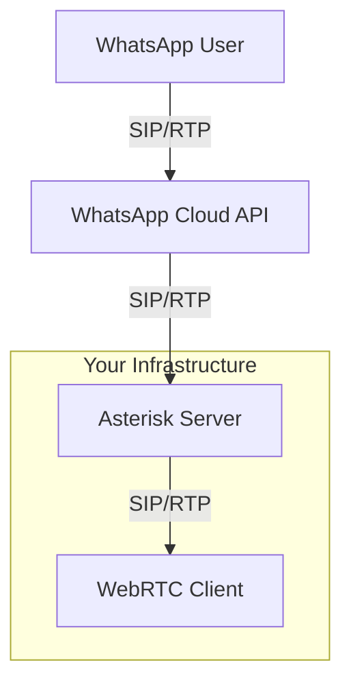

# WhatsApp Cloud API with Asterisk and WebRTC Integration

This document outlines the configuration and conceptual architecture for integrating WhatsApp Cloud API calling with an Asterisk server, enabling voice calls between WhatsApp users and a WebRTC client.

## Table of Contents

1.  [Architecture Overview](#architecture-overview)
2.  [Prerequisites](#prerequisites)
3.  [WhatsApp Cloud API Configuration](#whatsapp-cloud-api-configuration)
4.  [Asterisk Configuration](#asterisk-configuration)
    *   [pjsip.conf](#pjsipconf)
    *   [extensions.conf](#extensionsconf)
    *   [TLS Certificates](#tls-certificates)
    *   [ARI Configuration (ari.conf, http.conf)](#ari-configuration-ariconf-httpconf)
5.  [Functional ARI Script (Node.js)](#functional-ari-script-nodejs)
6.  [WebRTC Client Configuration](#webrtc-client-configuration)
7.  [Call Flows](#call-flows)
    *   [Inbound: WhatsApp User to WebRTC Client (via ARI)](#inbound-whatsapp-user-to-webrtc-client-via-ari)
    *   [Outbound: WebRTC Client to WhatsApp User](#outbound-webrtc-client-to-whatsapp-user)

## Architecture Overview

The system enables voice communication between WhatsApp users and a WebRTC client, using Asterisk as a SIP intermediary.

*   **WhatsApp Cloud API:** Connects to Asterisk via a SIP trunk for call signaling and media.
*   **Asterisk:**
    *   Receives SIP calls from WhatsApp.
    *   Routes calls to the appropriate WebRTC client extension.
    *   Receives SIP calls from the WebRTC client.
    *   Routes calls to WhatsApp via the SIP trunk.
    *   Handles SIP signaling and RTP media relay.
*   **WebRTC Client:** A browser-based SIP client (as found in this repository) that registers with Asterisk and makes/receives calls.
*   **ARI (Asterisk REST Interface) Script:** A Node.js script (`ari_scripts/ari_whatsapp_connector.js`) that connects to Asterisk's ARI interface to manage call logic, specifically for bridging incoming WhatsApp calls to the WebRTC client.



## Prerequisites

1.  An operational Asterisk server.
2.  A WhatsApp Business Account with a phone number enabled for Cloud API.
3.  Calling features enabled for your WhatsApp Business phone number, with SIP integration configured.
4.  TLS certificates for Asterisk (for WSS and DTLS-SRTP).
5.  The WebRTC client in this repository configured to connect to your Asterisk.

## WhatsApp Cloud API Configuration

1.  **Enable SIP for Calling:**
    *   In your WhatsApp Business Account settings, navigate to the Calling section for your phone number.
    *   Enable SIP integration. You will need to provide your Asterisk server's public IP address or hostname and the SIP port Asterisk is listening on (e.g., `your_asterisk_server_ip:5060`).
    *   WhatsApp will provide you with a SIP URI (e.g., `sip:<some_id>@c.whatsapp.net`) and potentially credentials or IP whitelisting requirements. This URI is referred to as `YOUR_WHATSAPP_SIP_URI` and its domain as `YOUR_WHATSAPP_SIP_DOMAIN` in the Asterisk configuration.
    *   Ensure that your Asterisk server's firewall allows traffic from WhatsApp's IP ranges on the configured SIP and RTP ports.

2.  **Set `srtp_key_exchange_protocol`:**
    *   The WhatsApp Cloud API documentation mentions configuring `srtp_key_exchange_protocol`. For WebRTC compatibility, DTLS is standard. If you encounter issues, you might need to align this setting with your Asterisk PJSIP endpoint configuration (which uses DTLS by default for WebRTC).

## Asterisk Configuration

Place the following configuration files (`pjsip.conf`, `extensions.conf`) in your Asterisk configuration directory (e.g., `/etc/asterisk/`).

### `pjsip.conf`

This file configures PJSIP endpoints, transports, and AORs (Address of Record).

```ini
[transport-udp]
type=transport
protocol=udp
bind=0.0.0.0 ; Binds to all interfaces for UDP SIP traffic

[transport-ws]
type=transport
protocol=ws ; WebSocket for WebRTC
bind=0.0.0.0:8088 ; Or your preferred port for WS, ensure it's different from WSS if used
; If using WSS (Secure WebSockets), configure as below:
; [transport-wss]
; type=transport
; protocol=wss
; bind=0.0.0.0:8089 ; Your preferred port for WSS
; cert_file=/etc/asterisk/keys/asterisk.pem
; priv_key_file=/etc/asterisk/keys/asterisk.pem
; method=tlsv1_2

;--- WhatsApp Trunk Configuration ---
[whatsapp_trunk_aor]
type=aor
contact=sip:YOUR_WHATSAPP_SIP_URI ; IMPORTANT: Replace with the SIP URI provided by WhatsApp
; remove_existing=yes ; Optional: if WhatsApp uses a dynamic contact

[whatsapp_trunk_endpoint]
type=endpoint
context=from-whatsapp ; Context for incoming calls from WhatsApp
disallow=all
allow=opus,ulaw,alaw ; Ensure these codecs match what WhatsApp supports
transport=transport-udp
aors=whatsapp_trunk_aor
from_domain=YOUR_WHATSAPP_SIP_DOMAIN ; IMPORTANT: Replace with WhatsApp's SIP domain (e.g., c.whatsapp.net)
send_rpid=yes ; Send Remote-Party-ID
trust_id_inbound=yes ; Trust identity from WhatsApp
rtp_symmetric=yes
force_rport=yes
rewrite_contact=yes
outbound_proxy=sip:YOUR_WHATSAPP_SIP_URI ; IMPORTANT: For sending calls TO WhatsApp

[whatsapp_trunk_identify]
type=identify
endpoint=whatsapp_trunk_endpoint
match=YOUR_WHATSAPP_SIP_DOMAIN ; Match incoming calls from WhatsApp's domain

;--- WebRTC Client Configuration ---
[webrtc_template](!) ; Template for WebRTC endpoints
type=endpoint
context=from-webrtc ; Context for outgoing calls from WebRTC client
disallow=all
allow=opus,ulaw,alaw ; Opus is highly recommended for WebRTC
transport=transport-ws ; Or transport-wss if you configured secure websockets
aors=webrtc_client_aor ; Placeholder, will be defined per client
dtls_verify=fingerprint
dtls_cert_file=/etc/asterisk/keys/asterisk.pem ; Path to your Asterisk certificate (fullchain)
dtls_private_key=/etc/asterisk/keys/asterisk.pem ; Path to your Asterisk private key
dtls_setup=actpass
ice_support=yes
media_use_received_transport=yes
rtcp_mux=yes
use_avpf=yes
force_avp=yes ; May be needed for some WebRTC clients
send_rpid=yes
trust_id_inbound=yes ; If you trust the identity from your WebRTC clients
rtp_symmetric=yes
force_rport=yes
rewrite_contact=yes

[webrtc_client_aor_template](!)
type=aor
max_contacts=1
remove_existing=yes ; Ensures only one registration per client

; Example WebRTC Client Endpoint
[web_client](webrtc_template) ; Inherits from webrtc_template
type=endpoint
auth_type=userpass
username=webclientuser
password=supersecretpassword ; Strong password recommended
aors=web_client_aor_specific

[web_client_aor_specific](webrtc_client_aor_template) ; Inherits from webrtc_client_aor_template
type=aor
; Specific AOR for this client, if needed, otherwise the template's aors can be used directly
; if the endpoint name matches the aor name (e.g. aors=web_client)
```

**Key `pjsip.conf` Notes:**

*   **`YOUR_WHATSAPP_SIP_URI`**: This is the full SIP URI provided by WhatsApp for outbound calls *to* them (used in `contact` for the AOR and `outbound_proxy` for the endpoint).
*   **`YOUR_WHATSAPP_SIP_DOMAIN`**: This is the domain part of the SIP URI from which WhatsApp will send calls *to* you (e.g., `c.whatsapp.net` or a specific subdomain). Used for `from_domain` and `match` in the identify section.
*   **Codecs:** Ensure `opus` is enabled and prioritized, as it's common for WebRTC and often supported by modern SIP providers. `ulaw` and `alaw` are good fallbacks.
*   **Transport:**
    *   WhatsApp typically uses UDP for SIP.
    *   WebRTC clients use WebSockets (`ws` or `wss`). If using `wss` (recommended for production), ensure `cert_file` and `priv_key_file` point to your valid TLS certificates.
*   **Authentication:** The `web_client` uses `userpass`. The WebRTC client in this repository will need to be configured with these credentials.
*   **`rtp_symmetric`, `force_rport`, `rewrite_contact`:** These are often necessary for proper NAT traversal with PJSIP.
*   **Firewall:** Ensure your firewall allows UDP traffic on your SIP port (default 5060) and the RTP port range (default 10000-20000 UDP) from WhatsApp's IP addresses. Also, allow TCP traffic on your WebSocket port (e.g., 8088 for `ws` or 8089 for `wss`) from your WebRTC clients.

### `extensions.conf`

This file defines the dialplan logic for routing calls.

```ini
[general]
static=yes
writeprotect=no
clearglobalvars=no

[globals]
WEB_CLIENT_EXTEN=1000 ; Example extension for the WebRTC client. This should match the user the WebRTC client registers as, or a way to reach them.
YOUR_WHATSAPP_BUSINESS_NUMBER=+12345678901 ; IMPORTANT: Your full WhatsApp Business number with country code
ARI_APP_NAME=whatsapp-ari-app ; Stasis application name, must match ari_whatsapp_connector.js configuration

[from-whatsapp]
; Context for incoming calls from WhatsApp
; Route to the Stasis application handled by ari_whatsapp_connector.js
exten => _X.,1,NoOp(Incoming call from WhatsApp: ${CALLERID(all)} to ${EXTEN}. Routing to ARI Stasis app: ${ARI_APP_NAME})
  same => n,Stasis(${ARI_APP_NAME},${EXTEN}) ; Pass the originally dialed number as an argument to the ARI app
  same => n,Hangup()

[from-webrtc]
; Context for outgoing calls from the WebRTC client
exten => _X.,1,NoOp(Outgoing call from WebRTC client ${CALLERID(num)} to WhatsApp user ${EXTEN})
  ; Set the Caller ID to your WhatsApp Business Number so WhatsApp recognizes the call origin
  same => n,Set(CALLERID(num)=${YOUR_WHATSAPP_BUSINESS_NUMBER})
  ; Dial out through the whatsapp_trunk_endpoint. The EXTEN here is the WhatsApp user's number.
  same => n,Dial(PJSIP/${EXTEN}@whatsapp_trunk_endpoint,60,Ttor)
  same => n,Hangup()

; Dialing the WebRTC client directly (e.g. if it registers as 1000)
exten => ${WEB_CLIENT_EXTEN},1,NoOp(Call to WebRTC client ${EXTEN} from ${CALLERID(num)})
  same => n,Dial(PJSIP/web_client,45,Ttor) ; Assumes web_client is the PJSIP endpoint name
  same => n,Hangup()
```

**Key `extensions.conf` Notes:**

*   **`WEB_CLIENT_EXTEN`**: This is the internal extension number you assign to your WebRTC client.
*   **`YOUR_WHATSAPP_BUSINESS_NUMBER`**:  Crucial for outgoing calls to WhatsApp. This ensures WhatsApp can correctly associate the call with your business account.
*   **`from-whatsapp` context**: When a call comes from WhatsApp, it will likely be to your main WhatsApp number. This context takes that call and dials your internal WebRTC client extension.
*   **`from-webrtc` context**: When your WebRTC client dials a number, this context sets the correct caller ID and dials out via the `whatsapp_trunk_endpoint`.
*   **`Dial` application options `Ttor`**:
    *   `T`: Allow the called party to transfer the call.
    *   `t`: Allow the calling party to transfer the call.
    *   `o`: Set the caller ID to what was set by `Set(CALLERID(num)=...)` for calls to the PJSIP channel.
    *   `r`: Generate ringing to the calling party.

### ARI Configuration (ari.conf, http.conf)

For the `ari_whatsapp_connector.js` script to function, you need to configure Asterisk's HTTP server and the ARI user.

**`/etc/asterisk/http.conf`**:
Ensure the HTTP server is enabled and configured (adjust `bindaddr` and `bindport` as needed).

```ini
[general]
enabled=yes
bindaddr=0.0.0.0 ; Or specific IP
bindport=8088     ; Port for ARI HTTP access
prefix=ari        ; Optional: sets the base path for ARI to /ari, so full URL is http://ip:port/ari/...
; enablestatic=yes ; If you want to serve static files via Asterisk HTTP
```

**`/etc/asterisk/ari.conf`**:
Define an ARI user that the Node.js script will use to connect.

```ini
[general]
enabled = yes
pretty = yes ; Useful for debugging ARI responses

[asterisk_ari_user] ; Username used in ari_whatsapp_connector.js
type = user
read_only = no ; Script needs to perform actions like originating calls, bridging
password = ari_password ; Password used in ari_whatsapp_connector.js
# If using plaintext passwords (not recommended for production without other security layers)
# password_format = plain
# For better security, consider using hashed passwords or other auth mechanisms if supported/needed.
```

After configuring these, reload the relevant Asterisk modules:
```bash
sudo asterisk -rx "module reload res_ari.so"
sudo asterisk -rx "module reload res_http_websocket.so" # If http.conf was changed
sudo asterisk -rx "http reload" # Or core reload
```

### TLS Certificates

For WebRTC (specifically for `wss` transport and DTLS-SRTP), Asterisk needs valid TLS certificates.

1.  **Obtain Certificates:** Use Let's Encrypt (recommended for public servers) or create self-signed certificates for testing.
    *   For Let's Encrypt, tools like `certbot` can automate this. You'll typically get `fullchain.pem` and `privkey.pem`.
2.  **Combine Certificates (if needed):** Asterisk PJSIP often expects the certificate and private key in a single `.pem` file for `dtls_cert_file` and `dtls_private_key`. You can concatenate them:
    ```bash
    cat /path/to/your/privkey.pem /path/to/your/fullchain.pem > /etc/asterisk/keys/asterisk.pem
    ```
    Ensure the private key comes first in the combined file.
3.  **Permissions:** Make sure the Asterisk user has read access to these certificate files.
    ```bash
    chown asterisk:asterisk /etc/asterisk/keys/asterisk.pem
    chmod 600 /etc/asterisk/keys/asterisk.pem
    ```
    (Adjust user/group if your Asterisk runs as a different user).

## Functional ARI Script (Node.js)

A Node.js script, `ari_scripts/ari_whatsapp_connector.js`, is provided to handle the call logic between WhatsApp and the WebRTC client using Asterisk's REST Interface (ARI).

**Location:** `ari_scripts/ari_whatsapp_connector.js`

**Purpose:**
*   Connects to Asterisk's ARI.
*   Listens for incoming calls on a specified Stasis application (e.g., `whatsapp-ari-app`, configured in `extensions.conf`).
*   When an incoming call from WhatsApp arrives:
    *   Answers the call.
    *   Originates a new call to the configured WebRTC client SIP endpoint (e.g., `PJSIP/web_client`).
    *   Creates a mixing bridge.
    *   Adds both the incoming WhatsApp channel and the outgoing WebRTC client channel to the bridge.
    *   Handles hangups on either channel to terminate the other and clean up the bridge.

**Prerequisites for the ARI Script:**
1.  **Node.js and npm/yarn:** Ensure Node.js is installed on the machine where you'll run this script (can be the Asterisk server or another machine with network access to Asterisk's ARI port).
2.  **Dependencies:** Install the necessary Node.js packages. The `package.json` has been updated to include `ari-client` and `ws`. Run:
    ```bash
    npm install
    # or
    # yarn install
    ```
3.  **ARI Configuration in Asterisk:**
    *   Ensure `http.conf` and `ari.conf` are configured as described in the "ARI Configuration (ari.conf, http.conf)" section above.
    *   The Stasis application name used in `extensions.conf` (e.g., `whatsapp-ari-app`) must match the `ARI_APP_NAME` environment variable or the default in the script.

**Running the ARI Script:**
1.  Navigate to the root of this project directory.
2.  You can run the script directly using Node.js:
    ```bash
    node ari_scripts/ari_whatsapp_connector.js
    ```
3.  **Environment Variables:** The script can be configured using environment variables for flexibility:
    *   `ARI_URL`: (Default: `http://localhost:8088`) URL for Asterisk ARI.
    *   `ARI_USERNAME`: (Default: `asterisk_ari_user`) Username for ARI connection.
    *   `ARI_PASSWORD`: (Default: `ari_password`) Password for ARI connection.
    *   `ARI_APP_NAME`: (Default: `whatsapp-ari-app`) Stasis application name.
    *   `WEBRTC_CLIENT_ENDPOINT`: (Default: `PJSIP/web_client`) The PJSIP endpoint for your WebRTC client.
    *   `WHATSAPP_TRUNK_ENDPOINT_FOR_OUTBOUND`: (Default: `PJSIP/whatsapp_trunk_endpoint`) PJSIP endpoint for dialing out to WhatsApp (used if ARI handles outbound).
    *   `YOUR_WHATSAPP_BUSINESS_NUMBER`: (Default: `+12345678901`) Your WhatsApp business number for outbound CallerID.

    Example:
    ```bash
    ARI_URL=http://192.168.1.100:8088 ARI_USERNAME=myariuser ARI_PASSWORD=securepass node ari_scripts/ari_whatsapp_connector.js
    ```
4.  **Process Management:** For production, you should run this script using a process manager like `pm2` or `systemd` to ensure it runs continuously and restarts on failure.

    Example with `pm2`:
    ```bash
    pm2 start ari_scripts/ari_whatsapp_connector.js --name whatsapp-ari-connector
    pm2 save
    pm2 startup
    ```

**Using `.env` for ARI Script Configuration:**

It is highly recommended to use a `.env` file to manage the configuration variables for the ARI script, especially for sensitive information like passwords.

1.  **Create a `.env` file:** In the root directory of the project, create a file named `.env`.
2.  **Populate `.env`:** Copy the contents from `.env.example` into your new `.env` file.
3.  **Customize Values:** Modify the values in `.env` to match your Asterisk ARI setup, desired endpoints, and WhatsApp business number.

    ```dotenv
    # .env (example content, customize for your setup)
    ARI_URL=http://localhost:8088/ari
    ARI_USERNAME=asterisk_ari_user
    ARI_PASSWORD=your_ari_password_here
    ARI_APP_NAME=whatsapp-ari-app
    WEBRTC_CLIENT_ENDPOINT=PJSIP/web_client
    WHATSAPP_TRUNK_ENDPOINT_FOR_OUTBOUND=PJSIP/whatsapp_trunk_endpoint
    YOUR_WHATSAPP_BUSINESS_NUMBER=+1yourwhatsappnumber
    ```
4.  **Loading `.env` (if not using a runner like `pm2` that handles it):**
    If you run the script directly with `node ari_scripts/ari_whatsapp_connector.js` and want it to automatically load variables from `.env`, you would typically use a package like `dotenv`.
    To add this:
    *   Install `dotenv`: `npm install dotenv` (or `yarn add dotenv`)
    *   Add this line at the very top of `ari_scripts/ari_whatsapp_connector.js`:
        ```javascript
        require('dotenv').config();
        ```
    The `package.json` would also need `dotenv` added to its dependencies. (Note: This step is informational as per the "no new library installation" constraint for the agent, but crucial for the user).

**Note on Outbound Calls via ARI:**
The current `ari_whatsapp_connector.js` includes a conceptual function `handleOutboundToWhatsApp`. However, the provided `extensions.conf` routes outbound calls from the WebRTC client directly through the SIP trunk without involving this ARI script. If you wish to have ARI manage outbound calls (e.g., for custom logic, logging, or dynamic caller ID manipulation before hitting the trunk), you would need to:
1.  Modify the `[from-webrtc]` context in `extensions.conf` to also send calls to the `Stasis(${ARI_APP_NAME},${EXTEN})` application.
2.  Fully implement and test the `handleOutboundToWhatsApp` function within the ARI script to originate the call to the WhatsApp trunk.

For the current setup, inbound calls from WhatsApp are the primary focus for ARI handling.

## WebRTC Client Configuration

The WebRTC client (from this repository, `src/lib/client-phone`) needs to be configured to register with Asterisk:

*   **SIP Server / WebSocket URL:** `ws://your_asterisk_server_ip:8088/ws` (or `wss://your_asterisk_server_ip:8089/ws` if using WSS). The `/ws` path is standard for PJSIP WebSocket transport.
*   **SIP Username:** `webclientuser` (from `pjsip.conf`)
*   **SIP Password:** `supersecretpassword` (from `pjsip.conf`)
*   **SIP Display Name:** Any preferred name.
*   **Extension to Dial:** When making outbound calls, the client will dial the WhatsApp user's phone number (e.g., `+15551234567`).
*   **Codecs:** Ensure the client is configured to use Opus.

## Call Flows

### Inbound: WhatsApp User to WebRTC Client

1.  WhatsApp user calls your WhatsApp Business Number.
2.  WhatsApp Cloud API sends a SIP INVITE to your Asterisk server (matching `whatsapp_trunk_endpoint` and `whatsapp_trunk_identify`).
3.  Asterisk routes the call to the `from-whatsapp` context in `extensions.conf`.
4.  The dialplan executes `Stasis(whatsapp-ari-app,${EXTEN})`, sending the call to the `ari_whatsapp_connector.js` application.
5.  The ARI script (`ari_whatsapp_connector.js`):
    a.  Receives the `StasisStart` event for the incoming WhatsApp channel.
    b.  Answers the incoming channel.
    c.  Originates a new call to the `WEB_CLIENT_ENDPOINT` (e.g., `PJSIP/web_client`).
    d.  Creates a new mixing bridge.
    e.  Adds both the incoming WhatsApp channel and the newly originated WebRTC client channel to the bridge.
6.  The WebRTC client's phone (softphone/application) rings and the user answers.
7.  Media (RTP) flows between the WhatsApp user and the WebRTC client, mixed through the ARI-controlled bridge in Asterisk.
8.  If either party hangs up, the ARI script handles tearing down the other leg of the call and destroying the bridge.

### Outbound: WebRTC Client to WhatsApp User

(This flow assumes the `from-webrtc` context in `extensions.conf` is NOT sending calls to the Stasis application, but dialing directly.)

1.  WebRTC client initiates a call to a WhatsApp user's phone number (e.g., `+15551234567`).
2.  The client sends a SIP INVITE to Asterisk.
3.  Asterisk routes the call to the `from-webrtc` context in `extensions.conf` (based on the `web_client` endpoint's context).
4.  The dialplan sets the `CALLERID(num)` to `YOUR_WHATSAPP_BUSINESS_NUMBER`.
5.  The dialplan executes `Dial(PJSIP/${EXTEN}@whatsapp_trunk_endpoint,...)`. Asterisk sends a SIP INVITE to the WhatsApp Cloud API via the `whatsapp_trunk_endpoint` using its `outbound_proxy` and `contact` in the AOR.
6.  WhatsApp Cloud API connects the call to the target WhatsApp user.
7.  Media (RTP) flows between the WebRTC client and the WhatsApp user, relayed by Asterisk and WhatsApp Cloud API.

---

This setup provides a foundational bridge between WhatsApp calls and a WebRTC client using Asterisk. Further customization for IVR, call recording, or advanced routing can be built upon this configuration, potentially leveraging ARI for more dynamic control. Remember to replace placeholders like `YOUR_WHATSAPP_SIP_URI`, `YOUR_WHATSAPP_SIP_DOMAIN`, `YOUR_WHATSAPP_BUSINESS_NUMBER`, and certificate paths with your actual values.
